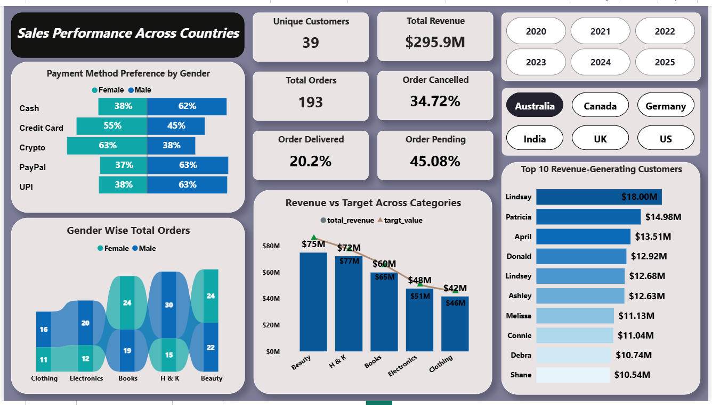

# 📊 Power BI Sales Performance Dashboard

This repository showcases a Power BI dashboard that provides a clear and interactive overview of sales performance across countries, customers, products, and payment types.

The dashboard is designed to help businesses monitor key KPIs such as delivery success, customer behavior, payment preferences, and revenue trends.

---

## 🖼️ Dashboard Preview

---

## 📄 Files Included

- `SalesDashboard_Report.pdf` – A detailed PDF report with visual-wise explanations, questions, and insights
- `SalesF.png` – A high-resolution screenshot of the actual Power BI dashboard

---

## 🔍 Key Insights from the Dashboard

- ✅ **Order KPIs**: Track percentage of delivered, cancelled, and pending orders
- 🧑‍🤝‍🧑 **Gender-wise Orders**: Analyze how order volume varies between male and female customers across categories
- 💳 **Payment Methods by Gender**: Discover payment preferences (Cash, Credit Card, UPI, etc.) by gender
- 🎯 **Revenue vs Target**: Compare actual revenue with target values across product categories
- 🧾 **Top Delivered Products**: Identify most frequently delivered items
- 👥 **Top Revenue Customers**: View top 10 customers contributing to revenue

---

## 📌 Use Case

This dashboard is ideal for sales teams, analysts, and business managers to:
- Monitor overall order and delivery performance
- Understand customer preferences and behaviors
- Plan targeted campaigns based on product or customer segment
- Evaluate performance against sales targets

---

## 📜 License

This project is licensed under the [MIT License](LICENSE).  
**Note:** The `.pbix` file is not included to maintain intellectual property and confidentiality.

---

## 🙌 Author

**[vikrant Ghale]**  

